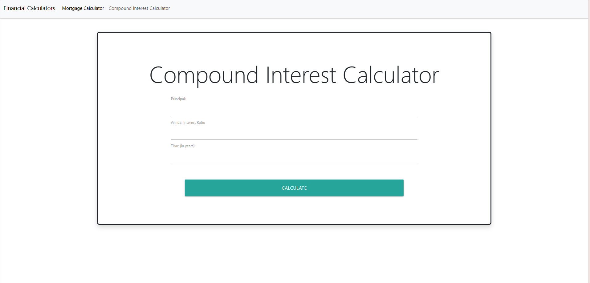
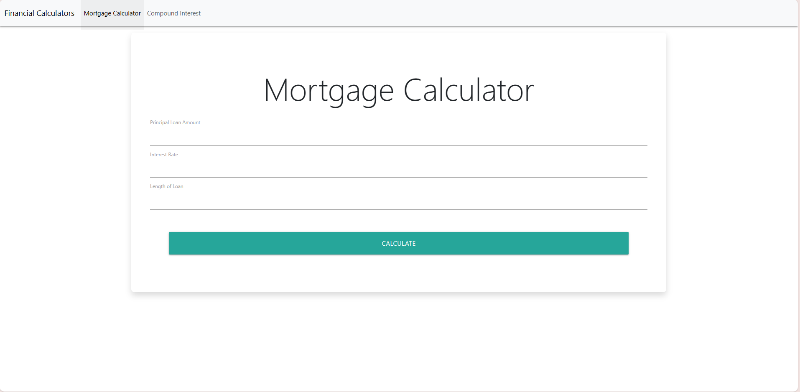

# Workbook 2 Workshop: Financial Calculators
Capstone 1: E-commerce
Application Development: Workshop 1. 

Description
In this project, I showcase my newly learned skills of JS by creating a Financial Calculator website. This websites demonstrates a combination of JS, HTML and CSS. In this demonstration, I have two calculators. For Css, I utilize Bootstrap and MaterializeCss for a reponsive framework and modern design. I have made 2 pages consisting of my mortgage calculator and compound interest calculator. For my work, I have started building out the framework using Visual Studio Code, developing a theme and then building my code around that theme for a fully-functioning display website. I have honed my fresh skills, in addition with HTML and CSS to fully build out the visual display for a calculator.

Description
The Mortage Calculator displays how much a monthly payment for a loan will be. The Compound Interest Calculator calculates the future value of a one-time deposit assumign compound interest. It is used to help you decided how much a CD will be worth when it matures. 

Executing program
You can the program by going to: https://github.com/ntinains/Workbook2_FinancialCalculators. Once there, download the zipfile for the code and then you should be able to open up my project from the index.

Help
If you have any advice or comments to make my page look more clean, sophisticated or commerically ready, please feel free to pull-request or comment.

Authors
Tina Nguyen https://github.com/ntinains

Version History
Inital Released on 10/22/2023

License
....

Acknowledgments

PluralSight.com | Youtube.com | Google.com | Gregory Testo |

Look at my project below:

